# HåfaPass Event-Day Operations

This is the operating contract for Phase 6 admissions and door sales. It explains what the software guarantees, what event staff must do, and which external approvals still block production card-present sales.

## Safety invariants

1. A scanner is authorized for one user, one organization, and one event, with an explicit expiration no later than 72 hours or 12 hours after the event.
2. A manifest is immutable, versioned, valid for no more than 24 hours, and signed with RSA-PSS/SHA-256. Production boot must supply `ADMISSION_MANIFEST_PRIVATE_KEY_PEM`; an ephemeral development key is not production-safe.
3. The browser verifies the payload digest, key identity, signature, event, and expiration before saving a manifest in IndexedDB. A changed signing key is rejected until the device is deliberately reset online.
4. The service worker never caches ticket-detail or authenticated attendee APIs. The offline manifest contains only ticket ID/code, attendee display name, ticket type, admission state, and a one-way credential hash.
5. Every device action has a durable UUID and monotonically increasing sequence. Server admission history is append-only; an undo creates a separately authorized reversal.
6. The first reconciled valid admission wins. A later admission for the same ticket is a visible conflict, including scans made on different devices while offline.
7. Cancelled, transferred, unfulfilled, disputed/payment-blocked, rotated, or otherwise revoked tickets never become valid merely because an old device submits them later.
8. Cash and confirmed card-present sales use the same order-item, inventory-hold, ticket, payment, fee, and settlement ledger as online checkout. Door allocation is a cap inside central inventory, not a separate inventory counter.
9. A card ticket is issued only after a provider response exactly confirms `SUCCESS`, the requested amount, the external payment ID, and a `CLOSED` card transaction. A timeout or malformed/mismatched response is `result_unknown`, holds inventory for investigation, and must never be entered as cash or charged again under a new key.

## Architecture and data flow

```mermaid
flowchart LR
  A["Authorized staff browser"] -->|"TLS + Clerk + event scope"| B["Register scanner device"]
  B --> C["Signed, versioned manifest"]
  C --> D["Verify RSA-PSS and store in IndexedDB"]
  D --> E["QR or manual lookup"]
  E --> F["Immediate local decision"]
  F --> G["Durable device queue"]
  G -->|"Connectivity restored"| H["Idempotent reconciliation"]
  H --> I["Append-only admission actions"]
  I --> J["Live counts and conflicts"]
```

The offline path does not call the public ticket endpoint. It hashes the scanned credential and looks it up in a verified local manifest, so cached feedback remains independent of network latency. Server reconciliation is still authoritative and can reject a locally accepted scan after a refund, transfer, credential rotation, payment block, device revocation, staff-expiration, or cross-device race.

## Before doors open

The named event-day lead must complete these steps while every device is online:

1. Confirm the event is published, schedule/timezone are correct, door allocations are intentional, and scanner/box-office staff have effective memberships and event assignments.
2. Register each physical browser from the Admissions control page. Give devices distinct operational names such as North Door 1, North Door 2, and Manager Desk.
3. On each device, select the event and confirm: green Online state, an effective device, manifest version, expected ticket count, future manifest expiration, zero unexpected queued scans, and a successful Sync now.
4. Test one dedicated test ticket on every camera/browser combination. Native `BarcodeDetector` is used where supported; the bundled ZXing reader is the fallback. Verify manual credential entry and attendee lookup.
5. Download and print the emergency door list. Store it with the event lead, not in a public area.
6. If accepting cash, prepare the cash-control process and staff sign-off. If accepting cards, confirm the UI says the Bank of Hawaii Clover account is `verified` and `payment_ready`; otherwise card must remain disabled.
7. Run the three-device conflict drill below. Do not open doors if signatures, device authorization, queue sync, counts, or the fallback list fail.

## Three-device offline drill

Use three separate devices or isolated browser profiles and a test event with representative tickets:

1. Download the same current manifest to all three devices, then disable Wi-Fi/cellular service.
2. Device A scans valid ticket 1. Device B scans valid ticket 2. Device C scans ticket 1 again. Each device must provide immediate local feedback and show a queued count.
3. On one device, test an invalid credential. Test manifest entries representing cancelled, transferred, payment-blocked, and already-admitted tickets. None may display a valid admission.
4. Reconnect Device B, then C, then A. Sync each device. Exactly one action for ticket 1 must be accepted; the other must appear as a conflict. Ticket 2 must be accepted.
5. Confirm dashboard totals, per-device last-sync times, recent actions, and append-only audit history. An authorized manager may queue an Undo; the original admission must remain recorded.
6. Confirm all local queues reach zero. Download a fresh manifest so all devices share the reconciled ticket state.

Automated coverage exercises a 500-ticket signed manifest, three device records, cross-device duplicate resolution, revoked credentials, authorization boundaries, and online p95 below 500 ms. Browser coverage verifies offline local acceptance, duplicate blocking, reconnection, queue drain, and cached p95 below 100 ms. A real-device drill is still mandatory before every pilot because camera, battery, browser, and venue-network conditions cannot be proven in CI.

## Live door operation

- Keep the Admissions control page open and watch Online/Offline, queued count, manifest expiration, admitted/remaining, conflicts, rejected actions, and device last-sync.
- A green local result means the signed cached data permitted admission. If offline, it is explicitly provisional until reconciliation.
- An amber duplicate means the ticket was already queued/admitted on that device or the server found a prior admission. Escalate to the manager; do not wave the attendee through twice.
- A red result must not be overridden by changing the payment method or sharing another ticket. Use attendee lookup, order support, or the printed list under the event's documented exception policy.
- Manual attendee lookup returns no buyer email. It may admit only a ticket present and valid in the signed manifest.
- Keep devices charged, prevent screen sleep where practical, and sync before moving a device to another door. Never share one registered browser profile between staff accounts.

## Door sales

Cash sales complete immediately and create a `door_cash` payment in the central ledger. Staff must physically receive the money before selecting Process Sale. Cash drawer reconciliation is an operational control outside the application and must match the box-office summary.

Card sales use `door_card` plus the verified `boh_clover` provider. The browser creates one idempotency key per sale and preserves it when the provider result is unknown. If the screen says “Do not charge the card again,” staff must:

1. Keep the order ID and terminal receipt/status.
2. Retry only from the same sale screen/idempotency key, or stop and escalate.
3. Compare HåfaPass, Clover, and the physical terminal before resolving the reconciliation case.
4. Never enter a compensating cash sale, create a second card request, or issue a ticket manually.

Bank of Hawaii markets Clover merchant services and Clover Station/Mini for businesses in Guam, making it the confirmed local provider path. Clover's REST Pay Display cloud connection is the hosted HåfaPass integration target; a local device-IP connection is not marked payment-ready by this deployment. Production still requires a signed merchant agreement, approved Clover app/REST Pay access, a provisioned device, OAuth/access credentials, provider sandbox certification, and a successful low-value live transaction. Sources: [Bank of Hawaii Clover merchant services](https://www.boh.com/business/merchant-services/clover), [Clover Station](https://www.boh.com/business/merchant-services/clover/station), [Clover Mini](https://www.boh.com/business/merchant-services/clover/mini), [Clover REST Pay introduction](https://docs.clover.com/dev/docs/rest-pay-intro), [Clover REST Pay payment flows](https://docs.clover.com/dev/docs/rest-pay-payment-flows), [Clover cloud connection request](https://docs.clover.com/dev/docs/build-a-cloud-connection-request).

Square is not a production alternative for this integration unless its contractual territory changes: its US payment terms limit service to the 50 states and District of Columbia, excluding Guam. Source: [Square Payment Terms](https://squareup.com/us/en/legal/general/payment).

Required production configuration:

- `ADMISSION_MANIFEST_PRIVATE_KEY_PEM`: stable RSA private key in encrypted secret storage.
- `CLOVER_REST_PAY_BASE_URL`: approved Clover REST Pay `/connect` base URL. Production code requires HTTPS on a Clover domain.
- `CLOVER_REST_PAY_ACCESS_TOKEN_ORGANIZATION_<id>`: encrypted OAuth/access token scoped to that HåfaPass organization (for example, organization 42 uses `CLOVER_REST_PAY_ACCESS_TOKEN_ORGANIZATION_42`). A global shared merchant token is intentionally unsupported. Never store the token in a card-present account row or return it to a browser.
- One admin-reviewed `CardPresentAccount` with Guam merchant approval evidence, merchant ID, device ID, and POS ID.

## Outage and fallback decisions

| Condition | Door action |
|---|---|
| API/network unavailable, valid unexpired manifest | Continue local scanning; monitor queue and reconnect deliberately. |
| Manifest expired or signature/key validation fails | Stop electronic admission; reconnect. Use the printed list only under the event lead's exception log. |
| Device authorization expired/revoked | Stop using that device. A manager must restore authorized access online. |
| Queue will not sync | Preserve the browser/profile, stop clearing site data, record device/event/time, and escalate. Other devices may continue. |
| Repeated conflicts | Check device sync/order, isolate the affected lane, and use attendee lookup or manager desk. |
| Clover result unknown | Do not retry with a new key and do not issue tickets. Reconcile provider and HåfaPass records. |
| Clover unavailable before a sale | Accept approved cash only, or stop door sales. Never label an unconfirmed transaction as card. |
| All electronics unavailable | Use the timestamped printed list and a numbered paper exception log; back-enter/reconcile admissions after recovery without rewriting history. |

## Closeout and data retention

1. Reconnect every scanner, sync until each queue is zero, and download the final dashboard/door totals.
2. Resolve conflicts, rejections, unknown card results, cash variance, and open reconciliation exceptions before settlement finalization.
3. Revoke devices that will not be reused. Do not clear browser storage until the server proves its queue was received.
4. Preserve append-only admission and payment audit records under the approved production retention policy. At event closeout, confirm every device is synced, export evidence, revoke its assignment, and use **Reset this device** to remove the IndexedDB manifest, device token, queue, and local scan state. Complete this within 24 hours after closeout unless an active incident/legal hold requires specifically documented evidence; a lost device is revoked immediately. Final server-side retention remains blocked on the professional review register.
5. Record any printed-list exceptions, device failures, network outage, card ambiguity, and attendee-impacting decision in the incident log.

## Release checklist

- [ ] Stable signing key configured, backed up, and rotation procedure tested.
- [ ] Three real devices pass the offline drill with the production candidate.
- [ ] 500-ticket load and p95 targets pass in CI and the pilot environment.
- [ ] Named event lead, technical escalation owner, spare devices/batteries, and venue-network fallback assigned.
- [ ] Emergency list printed immediately before doors and handled as restricted attendee data.
- [ ] Cash handling/variance procedure approved.
- [ ] BOH/Clover merchant, app, device, OAuth, sandbox certification, and live transaction gates complete—or card remains disabled.
- [ ] Reconciliation queue is empty before settlement closeout.
