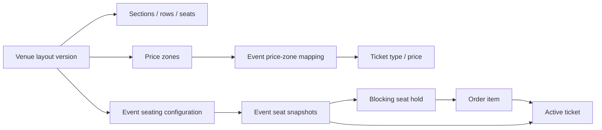

# Phase 10 — Assigned Seating and Larger Venues

Status: implemented for pilot validation
Last verified: July 21, 2026 (Pacific/Guam)

## Outcome

HafaPass now owns the canonical seat inventory and lifecycle for reserved-seat events. A venue layout can be reused across events, while each event receives an immutable seat snapshot mapped to its own ticket types and prices. Buyers and box-office staff use the same inventory and hold rules. A database-level blocking-hold index and active-ticket index prevent a seat from being held or sold twice.

This phase deliberately does not build an arena-grade drag-and-drop chart editor. The native section/row renderer and simple grid generator are suitable for Guam pilot venues and remain the accessible fallback. Complex visual diagrams can be integrated behind the renderer boundary without transferring inventory, order, credential, accessibility, or audit ownership to a vendor.

## Build-versus-integrate decision

### Decision: hybrid, with HafaPass as the system of record

HafaPass owns:

- Layout versions, sections, rows, price zones, seat accessibility and obstruction metadata.
- Event seat snapshots, sales state, price mapping, holds, orders, tickets, transfers, exchanges, refunds, check-in, and audit history.
- The non-visual/native accessible selector and organizer operational controls.
- Database constraints that prevent duplicate blocking holds and duplicate active tickets.

A provider adapter may own only:

- Rich diagram authoring for irregular theaters, stadiums, tables, booths, or general-admission areas.
- Optional visual rendering of a provider chart whose object keys map one-to-one to HafaPass `event_seats`.

The provider must never receive buyer identity unless separately approved, and its availability must not be trusted as the final checkout authority. HafaPass revalidates and locks every selected `event_seat` locally.

### Why Ticketmaster is not the dependency

Ticketmaster's Partner Availability and ADA APIs are partner-gated. Its availability documentation also warns consumers not to treat availability responses as the real-time checkout authority. Those APIs are useful evidence for expected concepts—reserved-seat details, accessible inventory, companion controls, channels, and orphan-seat validation—but are not a viable foundation for an independent Guam marketplace.

- [Ticketmaster Partner Availability API](https://developer.ticketmaster.com/products-and-docs/apis/partner/availability/)
- [Ticketmaster Partner ADA API](https://developer.ticketmaster.com/products-and-docs/apis/partner/ada/)

### Why Seats.io remains an option, not the ledger

Seats.io provides mature chart design, hold tokens, channels, best-available allocation, and selection validators. It is the strongest integration candidate when HafaPass reaches a venue whose geometry exceeds the native renderer. Its embedded designer requires server-side secret-key handling, and its status-change log is not a permanent HafaPass financial/operational audit record. Current pricing is usage-based and should be rechecked before contracting.

- [Seats.io pricing](https://www.seats.io/pricing)
- [Hold tokens](https://docs.seats.io/docs/api/hold-tokens/)
- [Best available](https://docs.seats.io/docs/api/best-available/)
- [Selection validators](https://docs.seats.io/docs/renderer/config-selectionvalidators/)
- [Sales channels](https://docs.seats.io/docs/api/channels-overview/)
- [Embedded designer security](https://docs.seats.io/docs/embedded-designer/introduction/)
- [Object status-change retention](https://docs.seats.io/docs/api/list-status-changes-for-an-object/)

## Domain model and invariants

The enforced invariants are:

1. A seat belongs to a row and a price zone in the same layout.
2. An event configuration can use only a layout owned by the event organization for the event venue.
3. Every active venue seat is copied into one event seat and mapped to an event ticket type.
4. At most one `active` or `claimed` seat hold may block an event seat.
5. At most one issued, checked-in, or legacy-transferred ticket may own an event seat.
6. Checkout line quantities must exactly equal the held seat counts by ticket type.
7. A hold snapshots its pricing tier and unit price; checkout claims that snapshot rather than silently repricing it.
8. Payment completion issues exactly one ticket for each claimed event seat and consumes the hold in the same transaction.
9. Expiration, checkout cancellation, refund, dispute loss, and free-ticket cancellation release inventory. Transfer preserves the seat. Exchange locks both seats, validates equivalence, changes ownership, and rotates both credentials.
10. Global sales suspension blocks new general-admission checkout and assigned-seat holds but does not disable valid ticket admission or reverse a payment already in flight.

## Accessible-seat policy implemented

The policy follows the US Department of Justice ticket-sales guidance and must receive legal/accessibility review before production:

- Accessible seats are exposed through the same purchase methods and sales stages as other seats.
- The seat map returns location, price, obstruction, accessibility kind, and availability without exposing buyer identity.
- Accessible seats use the ticket type mapped to their price zone, preventing an accessibility surcharge.
- Buyers attest that accessible seating is needed; no disability proof or medical documentation is requested.
- A protected companion seat must be selected with its wheelchair location, with no more than three companions per wheelchair group.
- Transfer leaves the accessible seat attached to the ticket on the same terms as any other transfer.
- Self-service exchange preserves ticket type/price category and accessibility kind. Support-assisted exceptions require a future documented workflow.
- Protected accessible/companion inventory enters general sale only after every standard seat is sold in the same section, price zone, or venue. Organizer blocking and house holds do not satisfy this test.
- Every controlled release stores the qualifying scope, evaluated standard-seat IDs, reason, actor, and time.

Authoritative source: [US DOJ — Ticket Sales](https://www.ada.gov/resources/ticket-sales/).

## Buyer, organizer, and event-day behavior

### Buyer

- Native buttons group seats by section and row; all details are present in accessible labels.
- Keyboard and assistive-technology users receive the same seats, prices, accessible metadata, obstruction warnings, and selection controls as pointer users.
- The selected seats are held for ten minutes and shown in checkout with a countdown.
- Orders, tickets, PDF downloads, confirmation email, Apple Wallet, Google Wallet, transfer, and exchange surfaces display the seat label.

### Organizer and box office

- Organizers can generate and publish a reusable pilot layout, map each price zone to an event ticket type, and activate the event snapshot.
- The live operations map can block, house-hold, reopen, and controlled-release selected seats.
- Emergency pause/resume is event-wide, reasoned, actor-attributed, and audited.
- Box-office operators select and hold exact seats before cash or card-present sale; the existing idempotent terminal workflow is preserved.

### Scanner and offline operation

- Admission manifests and door lists include the assigned seat label.
- Transfer and exchange rotate credentials, so stale saved codes cannot enter.
- Seat assignment does not change the established offline reconciliation rules.

## Operations

The existing `clock` process now enqueues `ExpireSeatHoldsJob` every minute in addition to order/inventory expiry. Alert on repeated `seat_hold_expiry_failed` events. Monitor:

- Active seat holds older than ten minutes.
- Pending orders whose seat session is not `claimed`.
- Completed orders whose seat session is not `consumed`.
- Tickets whose `event_seat` belongs to a different event or ticket type (the service/model guards should keep this at zero).
- Duplicate-index violations and seat-hold contention error rate.
- Accessible release count, actor, reason, and qualifying evidence.
- Sales suspension duration and unresolved suspension reason.

For a provider integration, add synthetic tests for provider outage, delayed callbacks, diagram-version mismatch, and object-key drift. The native renderer must remain available during provider degradation.

## Deployment and rollback

1. Deploy the additive migration before enabling assigned seating.
2. Start web, worker, clock, and Redis services.
3. Verify `ExpireSeatHoldsJob` execution and alerting.
4. Create a test venue layout and event configuration in a non-production event.
5. Exercise two-browser contention, payment expiration, cancellation/refund, transfer, exchange, accessible selection, controlled release, box office, scanner manifest, and door list.
6. Do not enable a third-party renderer until its contract, data processing, outage behavior, key storage, and object mapping have been approved.

The migration has been exercised down and back up on an empty Phase 10 dataset. That database rollback is destructive once assigned-seat records exist: Rails removes the ticket reference and then drops the new seating, release, and audit tables in dependency order. After any real use, roll back application code or disable assigned seating while preserving the schema and records; do not run the migration down. Take and verify a database backup before either path.

## Remaining external approvals

Code completion is not legal or venue approval. Before production assigned-seat sales, obtain:

- Accessibility counsel or qualified specialist approval of selection, pricing, companion, transfer, exchange, and release policy.
- Keyboard and screen-reader testing with representative users/devices.
- Venue sign-off that labels, accessible locations, companion groups, obstructions, capacity, and emergency holds match the physical room.
- Load testing at the expected onsale burst and database connection-pool size.
- Contract/security review before enabling Seats.io or another visual provider.
